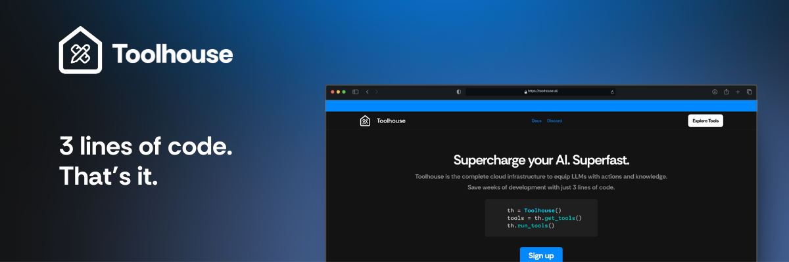

# Toolhouse TypeScript SDK

Welcome to the [Toolhouse TypeScript SDK](https://docs.toolhouse.ai/toolhouse/quick-start-typescript) documentation. This guide will help you get started with integrating and using the SDK in your project.

You can find example code for the following, natively-supported providers below:

- Anthropic Example
  - [JavaScript]((examples-js/src/anthropicExample.js)) | [TypeScript](examples-ts/src/anthropicExample.ts)
- OpenAI Example
  - [JavaScript](examples-js/src/openaiExample.js) | [TypeScript](examples-ts/src/openaiExample.ts)
- Vercel AI Example
  - [JavaScript](examples-js/src/vercelExample.js) | [TypeScript](examples-ts/src/vercelExample.ts)

## Table of Contents

- [Toolhouse TypeScript SDK](#toolhouse-typescript-sdk)
  - [Table of Contents](#table-of-contents)
  - [About the API](#about-the-api)
  - [Setup \& Configuration](#setup--configuration)
    - [Supported Language Versions](#supported-language-versions)
    - [Installation](#installation)
  - [Authentication](#authentication)
    - [Setting the Access Token](#setting-the-access-token)
  - [Configuration Options](#configuration-options)
  - [Usage](#usage)
  - [Services](#services)
    - [Methods](#methods)
      - [tools()](#tools)
      - [getTools()](#gettools)
      - [runTools()](#runtools)
    - [Accessor Methods](#accessor-methods)
      - [metadata](#metadata)
      - [provider](#provider)
  - [Error Handling](#error-handling)
  - [License](#license)

## About the API

The Toolhouse API provides access to various AI-powered tools and services, that you can install from the [Tool Store](https://app.toolhouse.ai/store).

## Setup & Configuration

### Supported Language Versions

This SDK is compatible with `TypeScript >= 4.8.4`.

### Installation

To get started with the SDK, we recommend installing it using `npm` or `yarn`:

```bash
npm install @toolhouseai/sdk
```

or

```bash
yarn add @toolhouseai/sdk
```

## Authentication

The Toolhouse API uses an Access Token for authentication. This token must be provided to authenticate your requests to the API.

To obtain an API Key, register at [Toolhouse](https://toolhouse.ai/).

### Setting the Access Token

When initializing the SDK, set the access token as follows:

```ts
const toolhouse = new Toolhouse({
  apiKey: process.env['TOOLHOUSE_API_KEY']
});
```

The `apiKey` is the only mandatory parameter and represents the API key required to authenticate with the tool provider.

You can find working examples in the [examples folder for JavaScript](/examples-js) and [examples folder for Typescript](/examples-ts).

## Configuration Options

In addition to the `apiKey`, you can configure the following options:

- `provider`: Specifies the provider, such as 'openai', 'anthropic', or 'vercel'. Defaults to 'openai'.
- `baseUrl`: Optionally specify the base URL for API requests.
- `timeoutMs`: The timeout for API requests, in milliseconds.
- `metadata`: Additional metadata to include with requests.

Example:

```ts
const toolhouse = new Toolhouse({
  apiKey: process.env['TOOLHOUSE_API_KEY'],
  provider: 'anthropic',
  timeoutMs: 10000,
  metadata: { customField: 'value' }
});
```

## Usage

Here's a basic example demonstrating how to authenticate and retrieve available tools:

```ts
import { Toolhouse } from '@toolhouseai/sdk';
import * as dotenv from 'dotenv';

dotenv.config();

async function main() {
  const toolhouse = new Toolhouse({
    apiKey: process.env['TOOLHOUSE_API_KEY']
  });

  const tools = await toolhouse.tools();
  console.log(tools);
}

main();
```

## Services

### Methods

#### tools()

Retrieves a list of public tools available from Toolhouse.

```ts
const tools = await toolhouse.tools();
console.log(tools);
```

#### getTools()

Fetches tools from a specific provider (OpenAI, Anthropic, or Vercel).

```ts
const tools = await toolhouse.getTools('default');
console.log(tools);
```

#### runTools()

Executes tools based on the provider and provided content.

```ts
const tools = await toolhouse.getTools();
const chatCompletion = await client.chat.completions.create({
  messages,
  model: 'gpt-3.5-turbo',
  tools
});

const openAiMessage = await toolhouse.runTools(chatCompletion);
console.log(openAiMessage);
```

### Accessor Methods

#### metadata

Retrieve or set the metadata used in tool requests.

```ts
console.log(toolhouse.metadata);
toolhouse.metadata = { newKey: 'newValue' };
```

#### provider

Retrieve or set the provider for tool requests.

```ts
console.log(toolhouse.provider);
toolhouse.provider = 'anthropic';
```

## Error Handling

Wrap API calls in try-catch blocks to handle potential errors:

```ts
try {
  const tools = await toolhouse.tools();
} catch (error) {
  console.error(error);
}
```

## License

This SDK is licensed under the Apache-2.0 License. See the [LICENSE](LICENSE) file for more details.